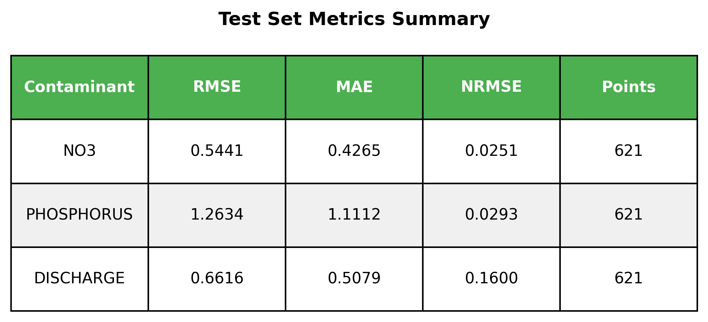
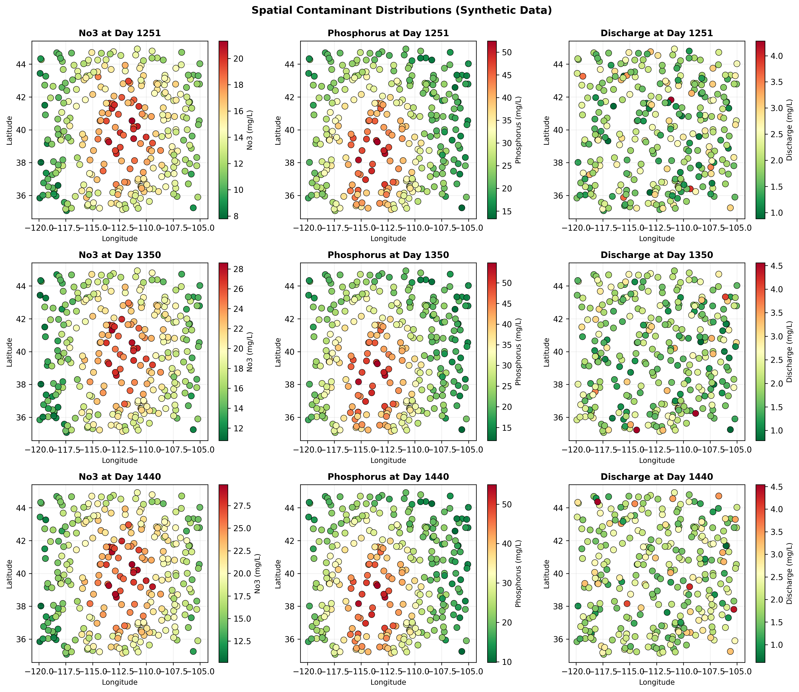
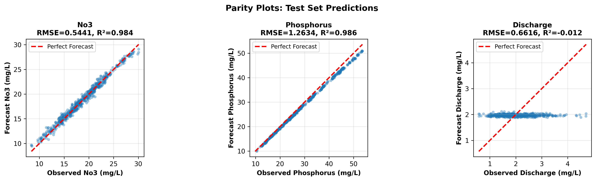

# Spatio-Temporal Deep Learning for Multi-Contaminant Forecasting in Sparse Watershed Networks
[](LICENSE)  
[](https://python.org)  
[](https://pytorch.org)

> **Note:** All the commands are based on a Unix based system.
> For a different system look for similar commands for it.
## Evaluation metrics on test set


## Spatial Pollutant maps


## Parity maps



## Setup

We are using Python version 3.11.9

```bash
$ python --version
Python 3.11.9
```
### Requirements

```bash
# Clone and install
git clone https://github.com/kagozi/Multi-Contaminant-Forecasting.git
cd Multi-Contaminant-Forecasting
```
### Python virtual environment

**Create** a virtual environment:

```bash
python3 -m venv .venv
```
`.venv` is the name of the folder that would contain the virtual environment.

**Activate** the virtual environment:

```bash
source .venv/bin/activate
```

**Windows**
```bash
source .venv/Scripts/activate
```


```bash
pip install -r requirements.txt
```

## Run full pipeline: preprocess → train → evaluate

```bash
python3 main.py
```